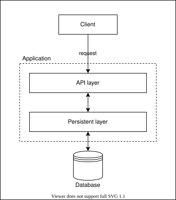

# 🟡 Pokedex Web Service

This is your first **real-world service** — combining everything from Stage 1 into a properly architected application. You'll design your own database, build a persistent layer, and expose it through a GraphQL API.

---

## 🎯 Goal

Create a Pokedex web service to record Pokemons and their abilities.

## 📋 Features

1. Create a new Pokemon
2. Update an existing Pokemon
3. Delete an existing Pokemon
4. List all Pokemons
5. Find a Pokemon by ID
6. Find a Pokemon by Name

---

## 🔧 Technical Implementation

### Tech Stack

| Tool | Role |
| :--- | :--- |
| **Go** | Programming language |
| **[Go-Chi](https://github.com/go-chi/chi)** | HTTP router |
| **[gqlgen](https://gqlgen.com/getting-started/)** | GraphQL code generator |
| **SQLite** | Persistent storage (recommended ORM: [bun](https://bun.uptrace.dev/) or [GORM](https://gorm.io/)) |

### Technical Requirements

1. The application must be a web service.
2. Use SQLite as persistent storage. **You must design your own database schema.**
3. API interface must be GraphQL.

> [!IMPORTANT]
> Unlike the Stage 1 movie reviews app, this project uses a **real database** — no more in-memory maps. This is the key step from prototype to production-shaped code.

---

## 📐 Data Structure

```yaml
type: Pokemon
properties:
  - property_name: name
    data_type: string
  - property_name: description
    data_type: string
  - property_name: category
    data_type: string
  - property_name: type
    data_type: [PokemonType]
  - property_name: abilities
    data_type: [string]
```

---

## 🏗️ Design Guide

This is a complex program. Design steps should be taken carefully — **think before you code**.

### Software Layers



The application is divided into two layers:

1. **Persistent Layer**: Interacts with the database. Contains functions for CRUD operations on your data models.
2. **API Layer**: Interacts with the user. Receives requests, passes data to the persistent layer, and returns responses.

> [!TIP]
> This separation is fundamental to maintainable software. When you need to switch from SQLite to PostgreSQL (which you will in the next assignment), only the persistent layer changes — the API layer remains untouched.

### Design Steps

#### 1. Design the Database

Design how your data will look. Create the tables using SQLite CLI or DBeaver.

> [!NOTE]
> If you need to install SQLite, see [Installing SQLite on Ubuntu](https://www.digitalocean.com/community/tutorials/how-to-install-and-use-sqlite-on-ubuntu-20-04).

#### 2. Design the Persistent Layer

Build a Go package that contains functions to add, update, delete, and find entries in the database. Create a database connection and use it for all operations.

#### 3. Design the API Layer

Define the GraphQL schema — `type`, `input`, `mutation`, and `query` — then generate the server with gqlgen.

#### 4. Combine Everything

Wire the persistent layer into the GraphQL resolvers and start the HTTP server.

---

## 📁 Project Structure Example

```text
pokedex/
├── database/
│   ├── db.go              # Database connection and setup
│   └── db_model.go        # Database model definitions
├── graph/
│   ├── model/
│   │   └── model_gen.go   # Generated by gqlgen
│   ├── generated.go       # Generated by gqlgen
│   ├── resolver.go        # Resolver dependencies
│   └── schema.resolvers.go # Your resolver implementations
├── main.go
├── go.mod
└── go.sum
```

---

## 📚 Useful Resources

- **[Pokedex Reference](https://www.pokemon.com/us/pokedex/)** — Use this as your data source.
- **[Learn SQLite](https://www.sqlitetutorial.net/)** — SQLite-specific tutorial.
- **[Learn GraphQL](https://graphql.org/learn/)** — Official GraphQL guide.

---

## 🧠 Mental Model Check
- **Design before code**: Database schema → persistent layer → API layer → integration.
- **Layers separate concerns**: The database doesn't know about HTTP. The API doesn't know about SQL.
- **Schema-first**: Both the database schema and GraphQL schema are designed *before* implementation.
- **This is the real pattern**: Production services follow this same layered architecture at scale.

Next: [Containers & Deployment](./3-container.md)
